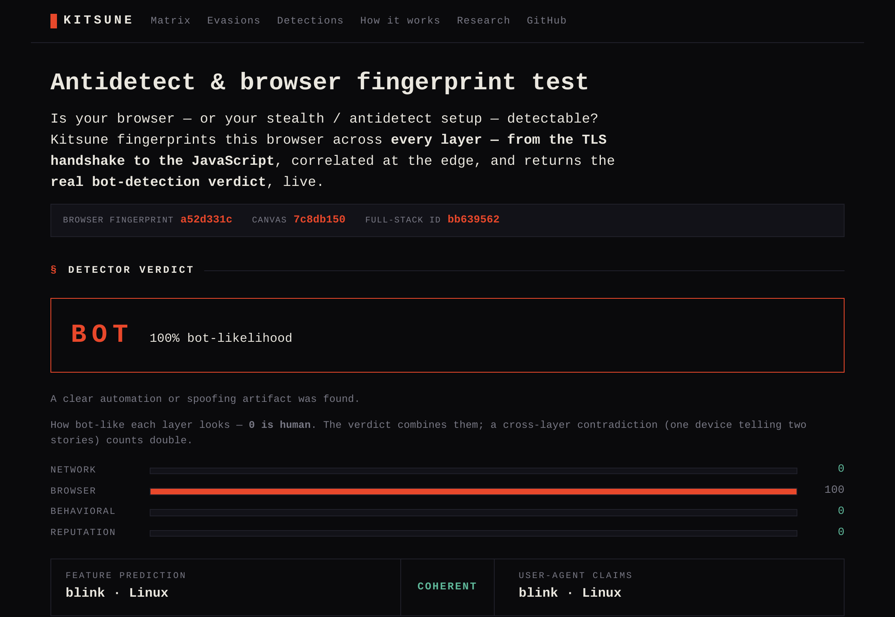

# Kitsune — a bot detection ⇄ evasion lab

> **TL;DR** — Both sides of the bot-vs-human arms race in one repo: a cross-layer fingerprint +
> behavioral **detector** (blue) and a fleet of real anti-detect **evaders** (red), scored against each
> other. The thesis: **catch the contradiction across layers, not the signal.** [Try it live →](https://kitsune.id)

[](https://github.com/datascry/kitsune/actions/workflows/ci.yml)
[](https://github.com/datascry/kitsune/actions/workflows/security.yml)
[](LICENSE)
[](https://www.conventionalcommits.org)

<p align="center"><strong><a href="https://kitsune.id">Try the live test → kitsune.id</a></strong></p>

<p align="center">
  <a href="https://kitsune.id"></a>
  <br /><sub>The live verdict, catching this capture's own headless browser — per-layer bars and the explainable tells.</sub>
</p>

The two sides run against each other to produce a reproducible, per-layer scoreboard, and the red team
keeps the blue team honest: no detection ships until a real evader has exercised it and the calibration
gate proves it doesn't flag real browsers. Named after the shapeshifting fox spirit.

## The thesis: catch the *contradiction*, not the signal

Modern anti-detect tools defeat single-signal detection — they patch `navigator.webdriver`, forge a
Chrome TLS fingerprint, randomize the canvas, spoof the timezone. So Kitsune doesn't grade signals in
isolation. It correlates everything a session emits — across the TLS handshake, the HTTP/2 preface, the
TCP/IP stack, the JS runtime, and behavior — and flags the **incoherence between layers** that a spoof
can't avoid:

- the TLS handshake says **Chrome on Windows**, but the TCP/IP stack says **Linux**;
- the page's `navigator` reports **8 cores**, but a **Web Worker** it spawns reports **12** — the spoof
  patched the main thread and forgot the second realm;
- every field is individually valid and mutually consistent, yet the **joint fingerprint is one no
  real user has** (the statistical-improbability frontier);
- one shared TLS identity fans out across **300 residential IPs** with per-instance-randomized JS — a
  coordinated fleet wearing distinct masks.

A real browser is coherent for free. A bot has to reproduce that coherence across *every* layer
simultaneously — and that is much harder than fooling any one of them.

## How it works

```
              one session_id — threaded through every hop

  evader ─▶ EDGE (Go) ─▶ COLLECTOR (TS) ─▶ DETECTOR (Python) ─▶ Verdict
             │              │                  │
       network.*       browser.* +       coherence engine (rules-as-data)
       TLS·JA4·HTTP-2   behavioral.*     → noisy-or ⊕ incoherence ⊕ gate
       QUIC·TCP/IP·DoS  canvas·WebGL              │
                        audio·realm·biomech       ▼
                        STORE ─▶ HARNESS ─▶ per-layer SCOREBOARD
```

The **edge** fingerprints the network layers a UA-spoofer can't reach (it terminates TLS and reads the
raw ClientHello), mints a `session_id`, and forwards `network.*` signals. The **collector** runs in the
browser and emits `browser.*` + `behavioral.*` signals under the same session. The **detector** groups
them into a session, runs a generic engine over the rules-as-data registry, and emits an explainable
verdict where every point of bot-likelihood traces back to its evidence. Components are polyglot and
**never import each other** — the JSON-Schema [`contracts/`](contracts) are the only coupling.

## What it detects

<!-- GENERATED:readme-stats:start -->
**139 live rules** (106 active · 33 experimental; 6 retired, ruleset `0.74.53`) — each a small predicate over the correlated session. **97 can convict** (coherence/automation/artifact); the rest only corroborate. Grouped by detection class:

| Class | Rules | Convicts? | What it catches |
|---|---:|:--:|---|
| **coherence** | 57 | ✦ | cross-vector contradictions (TLS↔TCP↔UA↔JS↔h2↔QUIC) — the thesis core |
| **automation** | 25 | ✦ | the framework surface: `webdriver`, CDP runtime, Electron, isolated-world leaks |
| **artifact** | 15 | ✦ | anti-detect *implementation* flaws: tampered natives, spoof placeholders |
| **environment** | 26 | — | stripped/headless capability gaps (corroborating only — see precision) |
| **behavioral** | 11 | — | mouse/keystroke biomechanics — path straightness, velocity CV, entropy floors |
| **reputation** | 4 | — | datacenter ASN / known proxy exit / WebRTC-leaked origin |
| **prevalence** | 1 | — | statistically-improbable-but-coherent fingerprints |

_✦ convicting · — corroborating-only. The conviction gate means corroborating signals can never reach `bot` alone._

<!-- GENERATED:readme-stats:end -->

A distinctive capability is the **realm-coherence family**: anti-detect tools spoof the main JS realm but
systematically forget *other* realms. Kitsune compares `navigator`, timezone, languages, the WebGL
renderer, and the canvas pixel-hash across the main thread vs a **Web Worker** and an **iframe** — and a
guard (`worker_constructor_tampered`) closes the one escalation, since wrapping `Worker` to spoof the
worker scope makes the constructor non-native. See the [detection catalog](docs/detection-catalog.md).

## Precision is a first-class concern

Catching bots is easy; not flagging real people is the hard part. Scoring is a transparent **noisy-or**
with cross-layer amplification, behind a **conviction gate**: a `bot` verdict requires at least one
*convicting* signal (coherence / automation / artifact). The *corroborating* classes — environment,
behavioral, reputation, prevalence — raise suspicion but can never convict alone, so a stripped-but-real
browser (no webcam, no plugins) can't noisy-or its way to `bot`.

The [**calibration harness**](docs/calibration.md) is the trusted-but-verified false-positive gate: it
scores thousands of real browser fingerprints and measures, per rule, how often each fires on a
legitimate browser. It is deliberately multi-source — a generated distribution (browserforge) *plus* real
Chromium/Firefox/WebKit captures — because you must never down-weight a rule on a single source's number.
Every new rule is grounded against a real browser *before* it ships, and a regression test fails the build
if any rule starts firing on a real engine.

## The red team

The evader fleet is a ladder of *real* open-source anti-detect tools, run only against Kitsune's own
detector — scripted TLS-mimicry (`curl-impersonate`, `primp`, `go-tls`/uTLS), Playwright-stealth and
CDP-leak patches (`patchright`, `rebrowser`), CDP-native drivers (`nodriver`, `zendriver`, `pydoll`),
isolated-world Selenium (`undetected`, `selenium-driverless`), the engine-level frontier (`Camoufox`),
farbling (`Brave`), HTTP/2 DoS, and an LLM agent — plus a multi-mode stealth harness that demonstrates
each realm-coherence evasion.

<!-- GENERATED:readme-redteam:start -->
**93 of 103 evaders score `bot`** ([full matrix](docs/matrix.md), ruleset `0.74.53`). The remaining 10 reach only `suspicious` — the conviction-gate frontier (top evaders, below): they defeat every *convicting* rule and trip only corroborating tells, which can never reach `bot` alone.

Each evader is a real anti-detect tool/technique; **Caught by** is the top convicting tell:

| Evader | Caught by (top convicting tell) | Incoh. | Score | Label |
|---|---|---|---|---|
| `curl-impersonate` | `net.no_js_execution` | 0.60 | 0.90 | bot |
| `nodriver` | `br.headless_ua` | 0.00 | 1.00 | bot |
| `full-stealth` | `br.cdp_runtime_enabled` | 0.60 | 1.00 | bot |
| `camoufox` | `net.tcp_os_vs_ua` | 0.84 | 1.00 | bot |
| `ios-ua-spoof` | `br.ch_he_headless` | 0.98 | 1.00 | bot |

**Top evaders — the conviction-gate frontier (10).** These real tools defeat every *convicting* (coherence/automation/artifact) rule and trip only corroborating tells, so the gate holds them at `suspicious` — never `bot` on corroboration alone:

| Evader | Trips (corroborating only) | Score | Label |
|---|---|---|---|
| `webrtc-leak` | `net.webrtc_ip_vs_observed`, `br.media_devices_empty` | 1.00 | suspicious |
| `zendriver-uach` | `bh.input_entropy_floor`, `br.hover_none_desktop` | 0.99 | suspicious |
| `camoufox-hardened` | `br.webrtc_unavailable`, `bh.power_law_violation` | 0.99 | suspicious |
| `camoufox-linux-coherent` | `br.webrtc_unavailable`, `bh.power_law_violation` | 0.99 | suspicious |
| `camoufox-linux` | `br.webrtc_unavailable`, `bh.power_law_violation` | 0.99 | suspicious |
| `zendriver-uach-behave` | `br.hover_none_desktop`, `br.webrtc_unavailable` | 0.99 | suspicious |
| `camoufox-hardened-behave` | `br.webrtc_unavailable`, `br.media_devices_empty` | 0.97 | suspicious |
| `camoufox-socks-webrtc` | `br.webrtc_unavailable`, `br.media_devices_empty` | 0.97 | suspicious |
| `camoufox-headful` | `br.webrtc_unavailable`, `br.media_devices_empty` | 0.95 | suspicious |
| `patchright-headful` | `br.media_devices_empty`, `br.voices_empty` | 0.93 | suspicious |

<!-- GENERATED:readme-redteam:end -->

## What's novel — detections unique to Kitsune

The field's pages (CreepJS, Sannysoft, pixelscan, …) are single-layer, client-side point-checks. Kitsune's
edge is **incoherence across layers _and_ time, scored server-side**. The three most differentiating
mechanisms:

- **Within-session temporal incoherence** — flags an *invariant* field that rotates under one session:
  TLS (`net.ja4_unstable_within_session`), origin (`net.ip_rotation_within_session`), browser fingerprint
  (`br.fingerprint_unstable_within_session`), trajectory replay (`bh.trace_replay_within_session`). No public
  fingerprinting page tracks rotation across a session — it catches the re-randomizing anti-detect browser
  that reuses one cookie.
- **Coalesced-pointer-event structural tell** (`bh.synthetic_no_coalesced` / `br.coalesced_untrusted`) —
  catches CDP-injected input via `getCoalescedEvents()` length + `isTrusted`, *independent of trajectory
  shape*, so a GAN/diffusion mouse-path humanizer that beats every shape metric is still caught.
- **Worker-realm coherence ladder** (`br.worker_source_rewritten`, `br.worker_constructor_tampered`) —
  convicts worker-scope spoof injection by the blob-URL + constructor-identity round-trip, robust to the
  entire Proxy-over-native disguise ladder.
- **Cryptographic agent identity** (`net.web_bot_auth_invalid`) — verifies an RFC 9421 Web Bot Auth
  signature at the edge: a *valid* signer is allow-listed as a `verified` agent (sound only under
  signing-key secrecy), while a forged/replayed signature for a known key convicts. FP-safe by
  construction — a real browser sends no such headers.

The rest — four-wire-layer ⇄ JS fusion and 2/3-power-law biomechanics
([`docs/detection-landscape.md`](docs/detection-landscape.md)), plus cloud-behind-residential-proxy
([`docs/coordination-proxy.md`](docs/coordination-proxy.md)) — round out the gap analysis. Every one was
grounded the same way: confirm the evasion **EVADES** first (a purpose-built red-team mode), then ship the
detection only once it **CONVICTS** that evader and stays clean on the calibration FP gate.

## The structural frontiers

Per-session detection saturates; the durable signals are structural, and Kitsune has working models for
both the red team flagged:

- **[Prevalence / likelihood](docs/prevalence-model.md)** — scores how improbable a fingerprint's *joint*
  field combination is under a real-traffic prior. It is the one class that scores a generator-assembled
  fingerprint with no contradiction. Corroborating-only (its prior is single-source) until a second source
  validates it.
- **[Coordination / fleet detection](docs/coordination-proxy.md)** — clusters sessions by JA4 and grades
  fleets via the TLS-identical-but-JS-divergent paradox + fingerprint-collision + per-launch TLS
  randomization, behind its own conviction gate (a real cohort sharing one browser build must not read as
  a botnet).

## Components

| Component | Lang | What it is | Tests |
|---|---|---|---|
| [`contracts/`](contracts) | JSON Schema | The stable wire contracts + the rules-as-data registry — the only coupling | CI-validated |
| [`detector/`](detector) | Python | Session correlation, the coherence engine, the conviction-gated scorer, the prevalence model, keyless (DB-IP Lite) City+ASN geo / IP-reputation enrichment | ~100% |
| [`harness/`](harness) | Python | The scoreboard, the calibration precision gate, the coordination scorer, biomech calibration (ethics enforced in code) | ~97% |
| [`edge/`](edge) | Go | TLS→JA3/JA4 (+ GREASE, post-quantum), HTTP/2 (Akamai + JA4H + unknown-engine), TCP/IP-OS, QUIC/HTTP-3 (RFC 9001 decrypt), HTTP/2 DoS attribution | ~97% (fp) |
| [`collector/`](collector) | TypeScript | In-browser fingerprint + behavioral collection + a CreepJS-style live self-test page running the full probe suite | 100% (logic) |
| [`evaders/`](evaders) | Py/TS/Go | The red-team ladder of real anti-detect tools (above) | all `bot` |

## Quickstart

```sh
# the Python spine (detector + harness): run the scoreboard demo
cd harness && uv sync && uv run python -m kitsune_harness

# everything, locally (headers · detector · harness · edge · collector)
task ci

# measure the false-positive rate against real browser fingerprints
task calibrate
```

Go and Node aren't required locally — use Docker (`golang:1.26-alpine`, `node:22-alpine`) for those.

## Docs

- [**Architecture**](docs/architecture.md) — the design: the pipeline, the coherence engine, the
  conviction-gated scorer, the structural frontiers, and the calibration discipline.
- [**Findings**](docs/findings.md) — the arms-race narrative: each evasion, the layer that caught it, and
  why (the Camoufox frontier, the precision turn, the realm-coherence family, the HTTP/2 DoS family, …).
- [Calibration](docs/calibration.md) · [Prevalence model](docs/prevalence-model.md) · [Coordination](docs/coordination-proxy.md) — the precision gate and the two structural frontiers.
- [Detection catalog](docs/detection-catalog.md) · [Evasion catalog](docs/evasion-catalog.md) — the blue/red work queues.
- [Coverage matrix](docs/matrix.md) — every detector rule × every evader.
- [Decision records](docs/adr) — MADR ADRs for the load-bearing decisions.
- [Contributing](CONTRIBUTING.md) · [Code of Conduct](CODE_OF_CONDUCT.md) · [Security](SECURITY.md) · [Changelog](CHANGELOG.md)

**Explore it live** (the same data, rendered + cross-linked at [kitsune.id](https://kitsune.id)):
[Detections](https://kitsune.id/detections) · [Evasions](https://kitsune.id/evasions) ·
[Matrix](https://kitsune.id/matrix) · [How it works](https://kitsune.id/how-it-works) ·
[Research](https://kitsune.id/research)

## Ethics

Evaders target **only** Kitsune's own detector and a fixed set of public endpoints built for bot/
fingerprint testing (sannysoft, CreepJS, BrowserLeaks, tls.peet.ws, the fingerprint.com demo,
incolumitas). Never a third-party or production site. The allow-list is **enforced in code**
([`harness/.../allowlist.py`](harness/src/kitsune_harness/allowlist.py)) — the self-contained arena *is*
the ethics design.

## License

[MIT](LICENSE).
